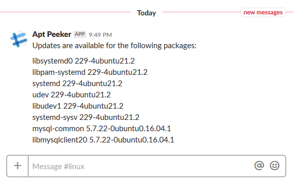

# aptpeeker
[](https://travis-ci.org/mwvdev/aptpeeker) [](https://codecov.io/gh/mwvdev/aptpeeker)

A REST service that can notify Slack when updates to aptitude packages are available.



# Try it out using Docker
AptPeeker is available on [Docker Hub](https://hub.docker.com/r/mwvdev/aptpeeker).

Try it out using an in-memory database:

``` bash
$ docker run mwvdev/aptpeeker -e notification.slack.endpoint=<insert slack incoming webhook endpoint>
```

Ensure that package lists are periodically updated and that `jq` is installed, then use the following command to report to a locally running instance:

``` bash
$ apt-get upgrade -s | grep ^Inst | awk '{ print $2,$3; }' | tr -d '[]' | jq --compact-output --slurp --raw-input 'split("\n") | map(select(. != ""))' | curl -X POST -u <insert user>:<insert password> -H 'Content-type: application/json' --data @- http://localhost:8080/api/package/updates
```

# Credits
This application is heavily inspired by [AptWatcher](https://github.com/honeybadger-io/aptwatcher) by [Honeybadger](https://www.honeybadger.io). 